# API Management Demo Setup

Setup:  Create Azure Storage Account, CosmosDB, Azure Search

<b>You must go through API Mangagement Setup at least once before the following demo will work.  API Mangement can take up to an hour to create.</b>

## Use template to create API Managment, Logic App, Azure Function and Web Service

1. Click Deploy to Azure button below.

1. Fill in the values of the template, giving the resource group a name and location.  Be sure to enter in your email address for the API Management.

    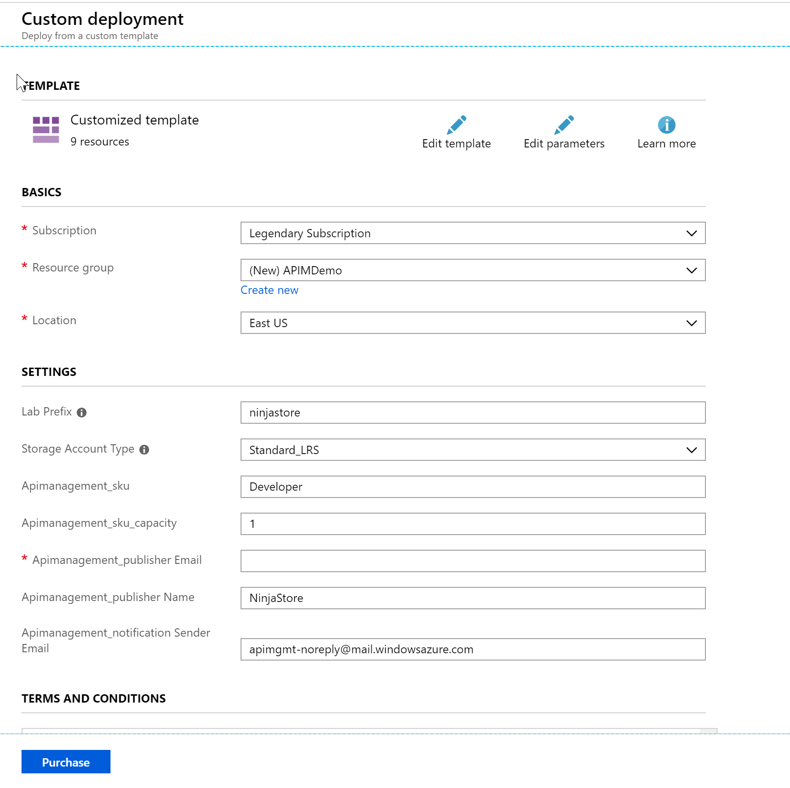

1. Select the terms and agreement check box and select purchase.

    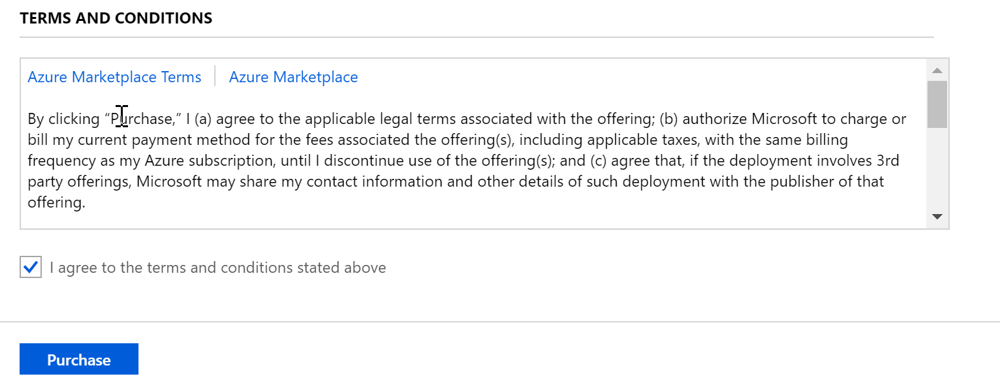

1. When the deployment finishes, we need to add the CosmosDB account key to the web services. Click on the "go to resource" button of the deployment notification

    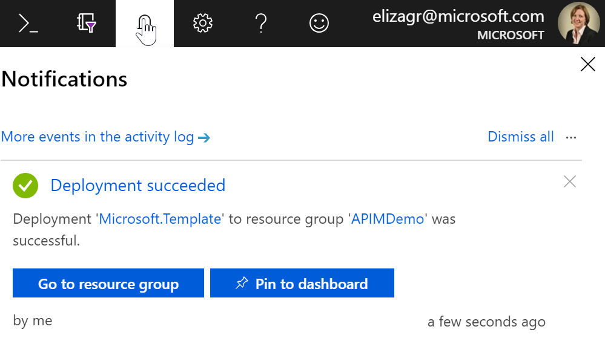

## Add CosmosDB Key to WCF Service

1. In the Resource Group, select the Azure CosmosDB Account.

    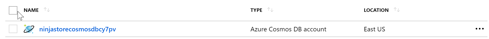

1. Select the Keys option from the left hand side.

    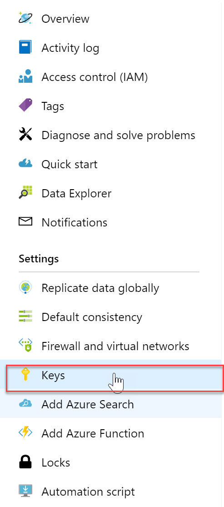

1. In the middle of the screen click the copy button of the Primary Key.  Save this value.

    

1. Go to the Resource Group (select the Resource Group breadcrumb from the top of the screen)

    

1. Select the App Service website that holds the WCF Service

    

1. From the left hand side, select Application Settings

    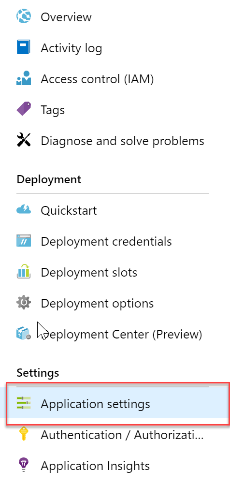

1. In middle screen, scroll down to the Application Settings section

    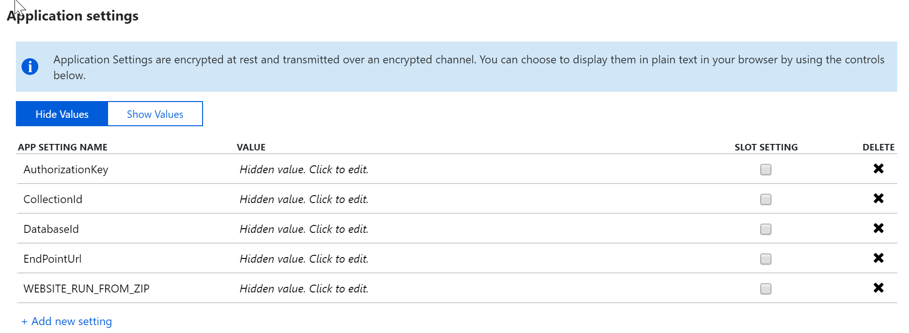

1. Select the Show Values button.

    

1. Select the AuthorizationKey value text box, and paste the CosmosDB Key into the box.

    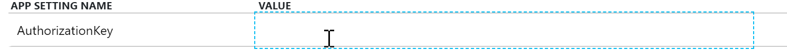

1. Press save.

    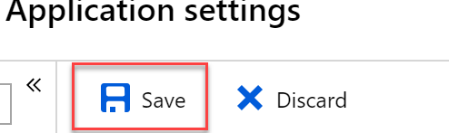

## Add CosmosDB Key to Azure Function

1. Go to the Resource Group (select the Resource Group breadcrumb from the top of the screen)

    

1. Select the Azure Function

    

1. In the middle of the screen, under Configured Features, select Application settings

    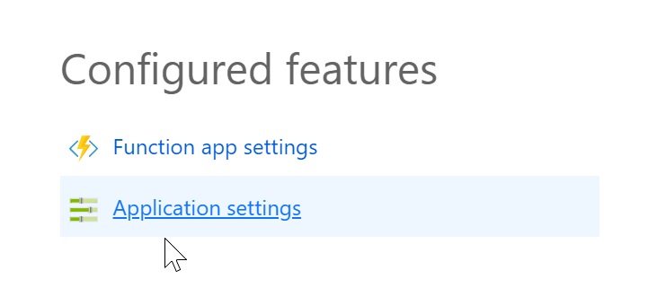

1. In middle screen, scroll down to the Application Settings section

    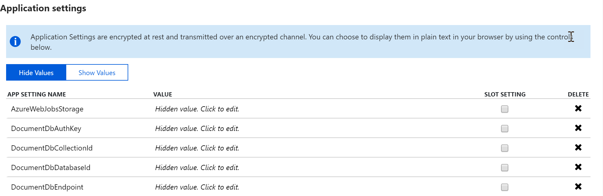

1. Select the Show Values button.

    

1. Select the DocumentDbAuthKey value text box, and paste the CosmosDB Key into the box.

    

1. Press save.

    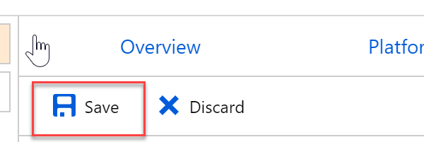

## Add CosmosDB Key to Logic App API Connection

1. Go to the Resource Group (select the Resource Group breadcrumb from the top of the screen)

    

1. Select the API Connection

    

1. On the left hand side, Select Edit API Connection

    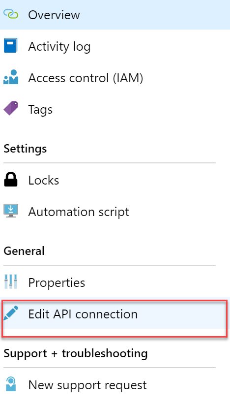

1. Paste the CosmosDB Key into the 'Access Key to your Azure CosmosDB account' textbox.

    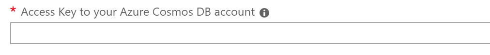

1. Press save.

    